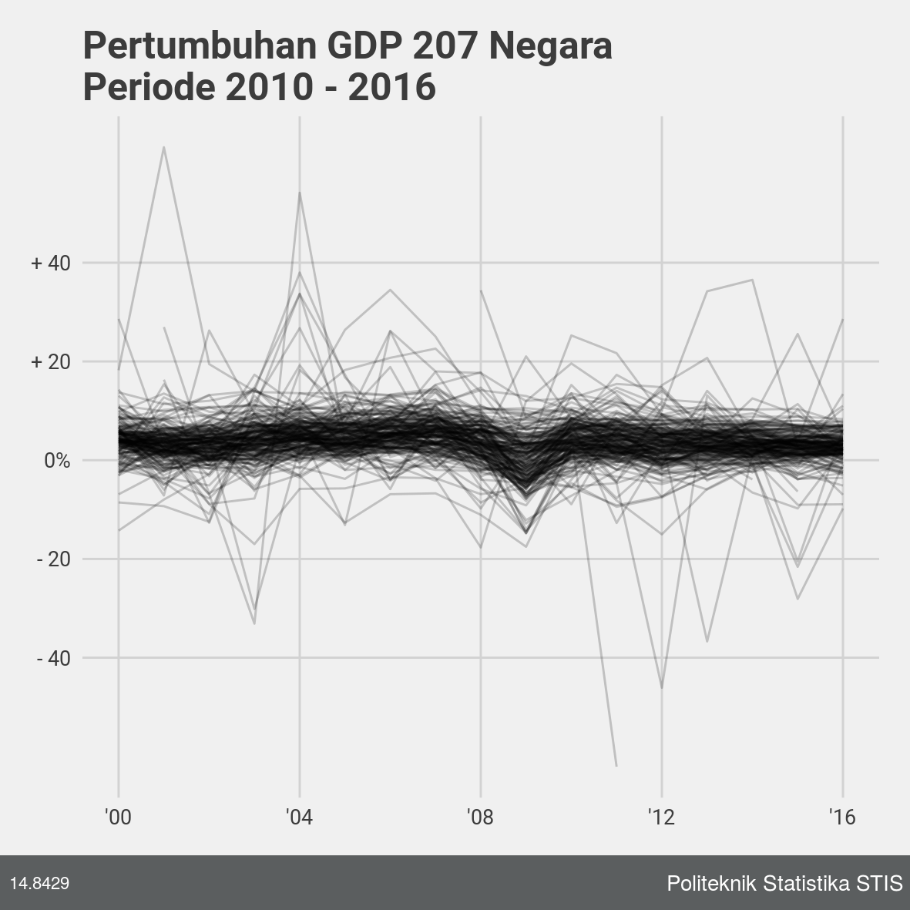
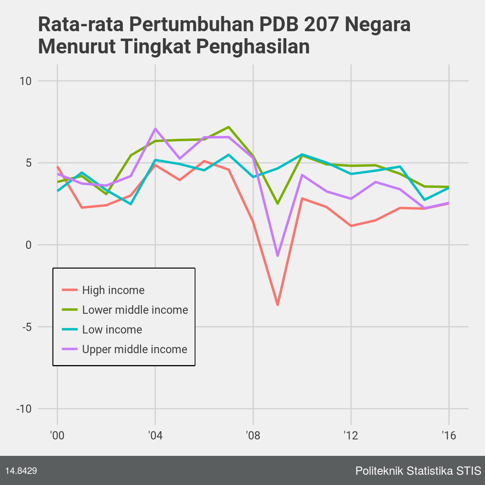

```{R setup, include=F}
library(tidyverse)
library(ggthemes)
library(wbstats)
theme_set(theme_fivethirtyeight())

GDPGRW <- read_csv("data/GDPGRW.csv")

# Gambar ---------------

footer_538 <- function(gg) {
  library(grid)
  require(gridExtra)
  grid.newpage()
  text.Name <- textGrob('  14.8429', x=unit(0, 'npc'), gp=gpar(col='white', family='sans', fontsize=8), hjust=0)

  text.Source <- textGrob('Politeknik Statistika STIS ', x=unit(1, 'npc'), gp=gpar(col='white', family='', fontsize=10), hjust=1)

  footer = grobTree(rectGrob(gp=gpar(fill='#5B5E5F', lwd=0)), text.Name, text.Source)

  plt.final <- gridExtra::grid.arrange(gg, footer, heights=unit(c(0.94, 0.06), c('npc', 'npc')))
}


axis_label_x <- paste0("'", c("00", "04", "08", "12", "16"))
```

Konvergen merupakan keadaan menuju suatu titik pertemuan.
Suatu variabel dinyatakan menuju konvergensi apabila penyebaran dari data tersebut semakin kecil dari waktu ke waktu.
Produk Domestik Bruto (PDB) merupakan salah satu indikator makro ekonomi.
PDB digunakan untuk memberi gambaran tentang kapasitas ekonomi suatu negara pada periode tertentu.

Pertumbuhan PDB menunjukkan pertumbuhan kapasitas ekonomi suatu negara.
Ketika berbicara mengenai konvergensi, maka negara-negara berkembang (nilai PDB rendah) perlu memiliki pertumbuhan PDB yang lebih tinggi daripada negara-negara maju (nilai PDB yang tinggi).
Hal tersebut ditujukan agar negara-negara berkembang mampu menyusul negara-negara maju.

Telah dikumpulkan data **Pertumbuhan PDB** dari Bank Dunia.
Data dikumpulkan sebanyak 207 negara dengan jumlah tahun yang berbeda-beda mulai dari tahun 2000.
Negara-negara di dunia pada umumnya memiliki nilai pertumbuhan GDP di bawah 20 persen, dan masih banyak yang memiliki pertumbuhan di bawah 10%.
Beberapa negara mengalami lonjakan pada tahun-tahun tertentu.
Pada Kondisi ini, tentu saja tidak mungkin terjadi konvergensi, karena setiap negara memiliki laju pertumbuhan yang sama.
Negara Berkembang tidak dapat menyusul negara maju jika pertumbuhan ekonomi mereka kurang lebih sama.

```{R gambar1, echo = FALSE, fig.cap = "Rata-rata Pertumbuhan PDB 207 Negara \nMenurut Tingkat Penghasilan", fig.width=4, fig.width=4}

```

Bank Dunia membagi negara-negara menjadi 4 klasifikasi pendapatan yaitu *High*, *Upper Middle*, *Lower Middle*, dan *Low*.
Berikut ini adalah hasil dari rata-rata tiap tahun bagi tiap-tiap kategori tingkat pendapatan.
Sekarang, dapat dilihat bahwa negara-negara yang tergabung dalam tingkat pendapatan *Lower Middle* dan *Low* memiliki rata-rata pertumbuhan yang lebih tinggi daripada *High* dan *Upper Middle*.
Hal ini menunjukkan bahwa masih ada kemungkinan bahwa suatu saat terjadi konvergensi, karena negara-negara berkembang secara rata-rata memiliki pertumbuhan yang lebih cepat daripada negara-negara maju.

```{R gambar4, echo = FALSE, fig.cap = "Rata-rata Pertumbuhan PDB 207 Negara \nMenurut Tingkat Penghasilan", fig.width=4, fig.width=4}

```

# Lampiran

*Source Code* dapat di akses melalui situs GitHub di https://github.com/rexevan/EkLan/tree/master/Konvergensi

```{R table, echo = FALSE}
library(knitr)
library(kableExtra)

GDPGRW <- read.csv("data/GDPGRW.csv")

GDPGRW_group <- GDPGRW %>%
  group_by(date, income) %>%
  summarise(mean_value = mean(value, na.rm = T)) %>%
  arrange(date, income)

GDPGRW_group %>%
  rename(Tahun = date) %>%
  spread(income, mean_value) %>%
  kable(format = "latex", booktabs =T) %>%
  kable_styling(position = "center")
```
